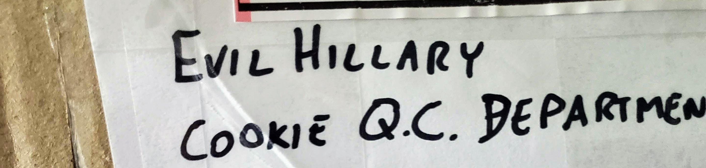
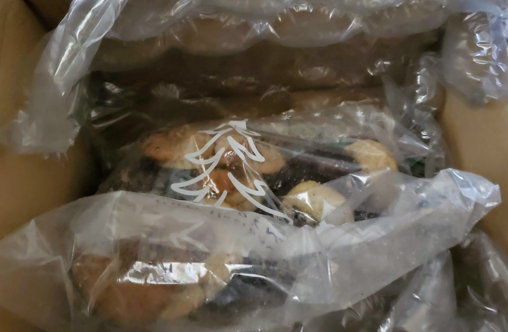
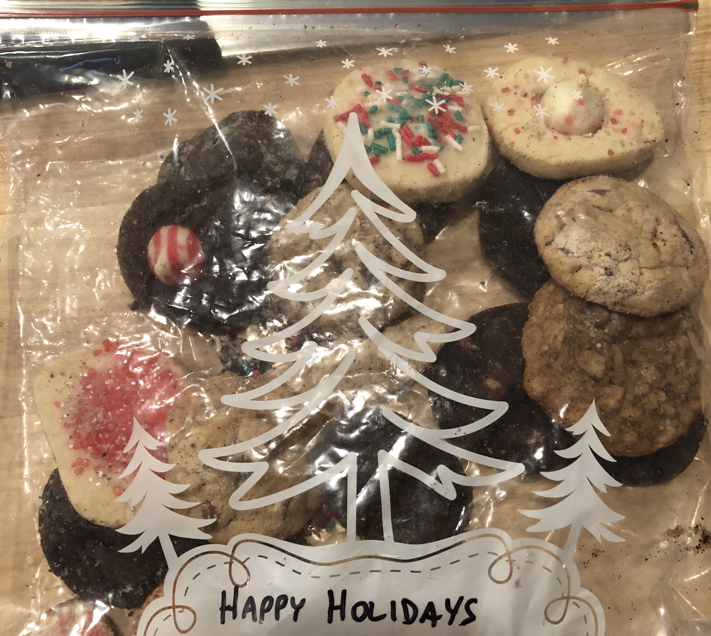

_From the archives of the Quality Control Department._

The Quality Control Department received a box of holiday-themed cookies. This report details the findings from thorough testing to our stringently-established quality measures and other close scrutiny.

Sample was extracted December 18, 2020 and received December 23, 2020 for evaluation.

## Packaging ##

Shipping box used properly-branded Evil Hillary iconography.

Shipping box was also appropriately addressed to the Quality Control Department for evaluation and disposition.

Tape (adhesive packaging cellophane tape) was applied in a pattern around and across the shipping container in a manner adequate to keep the box and its contents closed during transit, yet which yielded easily to an expertly-wielded pair of scissors.

**Packaging: 5/5**

## Odor ##

A delicious odor wafted out of the shipping box as it was opened to reveal a bag of cookies nestled safely in bubble wrap.

Orthonasal olfaction tests on the cookie-related volatiles produced the following conclusion:

> Definitely delectable. Piques the palate.

**Odor: 5/5**

## Contents ##

For the contents, we evaluated based on several criteria, each of which was subsequently rated on a 5-point scale:

- Taste - a _completely objective_ evaluation of deliciousness
- Variety - a measure of the diversity of the selection presented
- Satisfaction - a _completely objective_ evaluation of post-ingestion happiness

The cookies were delicious and quite satisfactory. The entire shortbread-based selection vanished almost instantly.

For each provided sample cookie, the reviewer took a large bite and carefully considered its flavor profile while chewing. Retronasal olfactory samples confirmed that each sample incorporated its ingredients and flavorings to provide a balanced and delectable finish. This process was repeated to verify the results were repeatable for each sample.

### Taste: 5/5 ###

The extracted sample included a considerable selection of textures and base flavors from shortbread to sugar to chocolate and beyond.

There were several kinds of cookie toppings on offer, including a frosting glaze with sprinkles in it that this reviewer found especially delightful.

### Variety: 5/5 ###

The only surprise during evaluation was a "cookie" which appeared to be biscotti but, when initially bitten into, revealed itself to be a bread rind. We concluded this was added to keep the cookies fresh and deduct no points for the very startling experience. We have updated our evaluation procedures to prevent recurrence.

The evaluators were very satisfied by this evaluation procedure. Through ingestion of the contents of this sample, the reviewers found they no longer required ingestion of additional materials other than liquid water or milk, including `lunch`.

### Satisfaction: 5/5 ###

## Evaluation Scoring ##

- Packaging: 5/5
- Odor: 5/5
- Contents: 15/15

**Total Evaluation Score: 25/25**

## Conclusion ##

### Holiday Cookies: certified A+ awesome ###

---

Thank you for using the services of the Evil Hillary Quality Control Department. For any questions, please contact [qualitycontrol@evilhillary.com](mailto:qualitycontrol@evilhillary.com).
