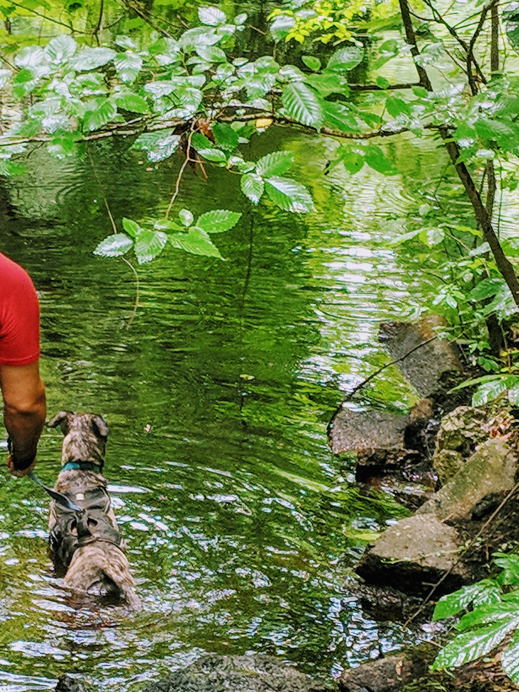
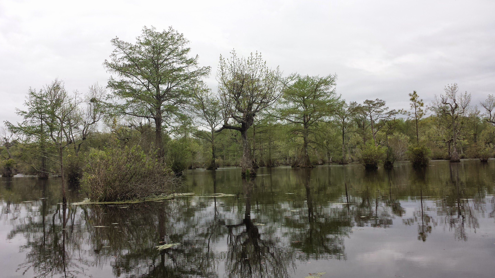

We enjoy hiking (especially with dog) and kayaking in the northeastern NC (and southeastern VA) region. Here are some local parks we've visited or would like to, with an emphasis on availablity of kayaking.

## Great Dismal Swamp Canal ##

- NCParks: [Great Dismal Swamp State Park](https://www.ncparks.gov/dismal-swamp-state-park/home)
- Address: [2356 US-17, South Mills, NC 27976](https://www.google.com/maps/place/Dismal+Swamp+State+Park/@36.504978,-76.3579977,17z/data=!3m1!4b1!4m5!3m4!1s0x89a554d85822a177:0x60ac302c9338e671!8m2!3d36.504978!4d-76.355809)
- Canoe rentals: Yes
- Public launch: Yes

This starts out at a welcome center and state park attached to a rest stop along US-17 in northeastern North Carolina. The welcome center has a neat little mini-museum of the local habitat, wildlife, and history. The main walking paths are from when they used to pull logs down the canal so it's straight, level and connects to Deep Creek in Virginia.

They also do canoe and kayak rentals during the summer in the canal itself - there's a lot to look at and not much current to fight, so it's great for beginners.

We took Belle on an adventure here and she tried to go swimming in the canal - fair warning!

## Merchant's Millpond State Park ##

- NCParks site: [Merchant's Millpond State Park](https://www.ncparks.gov/merchants-millpond-state-park/home)
- Address: [176 Mill Pond Rd, Gatesville, NC 27938](https://www.google.com/maps/place/Merchants+Millpond+State+Park/@36.4374991,-76.703801,15.79z/data=!4m5!3m4!1s0x89afe4f6a2e609b9:0xce49f9d091208682!8m2!3d36.4372051!4d-76.6991524)
- Canoe rentals: Yes
- Public launch: Yes

There are a number of easy and flat, often paved, trails of various lengths - visit the [NC Parks trails list to see details](https://www.ncparks.gov/merchants-millpond-state-park/trails).

In 2015, we went to a ranger-led canoe tour to try to see alligators, but unfortunately the weather didn't cooperate. At the time, the millpond was home to three alligators.

